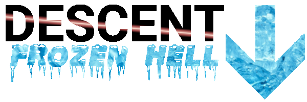

# Descent: Frozen Hell

**Series**: Descent\
**Pack**: Frozen Hell\
**Launch**: 16/09/2018\
**Status**: Shut down on 30/12/2020\
**Latest Version**: 1.9.1

**Contributors:**
- CitadelCore (Server, pack configuration)
- Oskutin (World design)
- Skye (pack configuration)
- ThePiGuy24 (pack configuration, asset design)
- NickStalburg (pack configuration)
- Raeffi (pack configuration, asset design)

Frozen Hell was a large general-purpose themed 1.12.2 pack centered around the concept of survival in a frozen wasteland where resources were scarce. The map, built in a world generation program, was designed by Oskutin. Crafting recipes were also modified with CraftTweaker in order to make certain recipes harder.

A short period into Frozen Hell, both BetterWithMods (BWM) and Tough as Nails were removed, which made the pack a lot easier.

The server eventually shut down due to lag problems. Many large tech mods with multiple addons (Thermal Expansion, Industrial Foregoing, Immersive Engineering, Ender IO) plus the sheer density of the large chunkloaded areas made for consistent framerates below 15 FPS and the server not being above 10 TPS.

## Mods that should not be updated
- CreativeCore (breaks multiblocks)
- Immersive Technology (removes coke ovens)
- Railcraft (causes crash on start due to a conflict with computronics)

## Known issues
- SpongeForge's jarfile must be prefixed with `_a` due to another mod that applies an old mixin, causing a conflict.

## Players
- LumiVaris
- MrGermandeutsch
- XionNeutrino
- Doctro
- GotMinecraftFree
- Alsthom1
- Doctor_Squibs
- LizzyTheSiren
- E74237
- skyem
- Jubi2
- R0CK3R
- Nextej
- RubenSoetens
- Raeffi
- SprocketDragon
- bmwcrazy456
- littleoadYT
- CitadelCore
- C74237
- LukeCastellan
- 008luc
- eclipsespilce
- Jugostran
- DankestDaddy
- Izaya
- Zirklop
- NikkyAi
- Osku
- AshleighTheCutie
- ACFC2
- RustinF
- ThePiGuy24

## Mods
- Advanced Chimneys
- AE2 WT Lib
- Alternating Flux
- Applied Energistics 2
- ArchitectureCraft
- AutoRegLib
- Avaritia
- Avaritia's Complement
- Baubles
- Better Advancements
- Better Builders' Wands
- Booster Rockets
- Buildcraft
- Catwalks 4
- Chameleon
- Charset
    - Audio
    - Block Carrying
    - Immersion
    - Lib
    - Storage Locks
    - Tablet
    - Tools
    - Tweaks
    - Patches
- Chisel
- Chisels & Bits
- CodeChickenLib
- CoFH Core
- CoFH World
- Colytra
- Commons0815
- Computronics
- CraftTweaker
- CreativeCore
- Connected Textures Mod
- Decocraft
- Dynamic View
- Effortless Building
- Ender IO
- Ender IO Endergy
- EnderCore
- Engineered Golems
- Engineer's Decor
- Engineer's Doors
- Engineer's Tools
- Expanded Arcanum
- Extra Utilities 2
- Faster Ladder Climbing
- FoamFix
- Forge EnderTech
- Gravestone Mod
- Guide API
- Gunpowder Lib
- ICBM Classic
- iChun Util
- Immersive Cables
- Immersive Engineering
- Immersive Floofs
- Immersive Petroleum
- Immersive Railroading
- Immersive Posts
- Immersive Technology
- Industrial Foregoing
- Industrial Wires
- Integration Foregoing
- Inventory Tweaks
- Just Enough Items
- JourneyMap
- Just Enough Petroleum
- Just Enough Resources
- MatterLink
- ModTweaker
- Modular ForceField System
- More Avaritia
- More Libs
- More Plates
- MrTJPCore
- MTLib
- NuclearCraft
- OCDevices
- OnlinePictureFrame
- OpenComputers Book Converter
- OpenComputers
- OpenFM
- OpenPrinter
- p455w0rds library
- ProjectRed
    - Compat
    - Core
    - Exploration
    - Fabrication
    - Illumination
    - Integration
- PTRLib
- Railcraft
- Redstone Arsenal
- Redstone Flux
- Redstone Gauges and Switches
- Satako Library
- Shadowfacts Forgelin
- Spawner Imbuer
- NoMoreRecipeConflict
- Storage Drawers
- SwingThroughGrass
- Sync
- Tails
- TeslaCoreLib
- Thaumcraft
- Thaumcraft Inventory Scanning
- Thaumic Additions
- Thaumic Augmentation
- Thaumic Calculations
- Thaumic Energistics
- Thaumic JEI
- Thaumic Periphery
- Thaumic Tinkerer
- TheOneProbe
- TheOneProbe Addons
- Thermal Dynamics
- Thermal Expansion
- Thermal Foundation
- Track API
- TreeChopper
- Universal Mod Core
- Wearable Backpacks
- Wireless Crafting Terminal
- Zetta Industries
