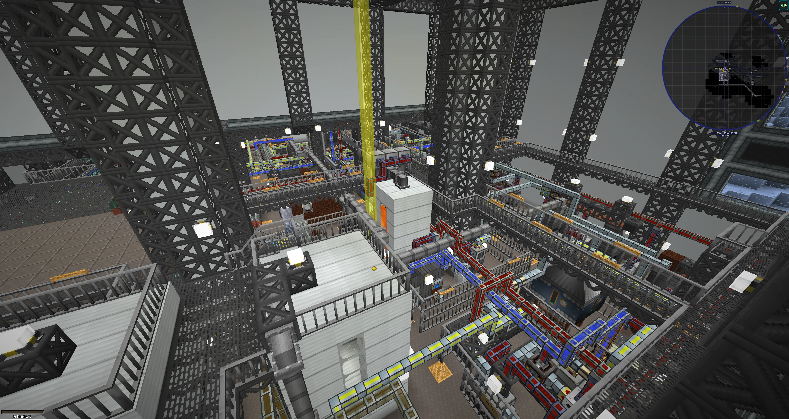

# Descent: Frozen Hell

**Series**: Descent\
**Pack**: Frozen Hell\
**Launch**: 16/09/2018\
**Status**: Active\
**Latest Version**: 1.16.0

**Contributors:**
- Vertex (Server, pack configuration)
- Oskutin (World design)
- Skye (pack configuration)
- ThePiGuy24 (pack configuration, asset design)
- NickStalburg (pack configuration)
- Raeffi (pack configuration, asset design)

Descent: Frozen Hell is a private 1.12.2 Minecraft SMP - running on a custom modpack - designed to keep you immersed in a **living industrial world**. Having restarted recently, the server has had a fresh overhaul with fully updated mods and significant optimisations.

Our world has a rich history, spanning over three years. Will you open a manufacturing enterprise in the brutalist city of Perkelgrad, or settle down in the comparatively peaceful Valley Forest? Or fend for yourself, staking your claim in the icy wilderness? The choice is yours - the world is a canvas for your creativity.

## History

Frozen Hell started in late 2018, based around the concept of survival in a frozen wasteland with scarce resources. The map, built in a world generation program, was designed by Oskutin. Crafting recipes were also modified with CraftTweaker in order to make certain recipes harder.

A short period into Frozen Hell, both BetterWithMods (BWM) and Tough as Nails were removed, which made the pack a lot easier - though many recipes still incorporate elements of realism.

## Mods
Run `packwiz list` for an up-to-date list of mods.

## Images

